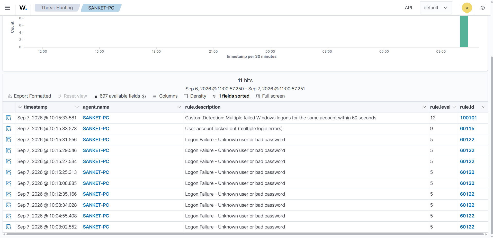
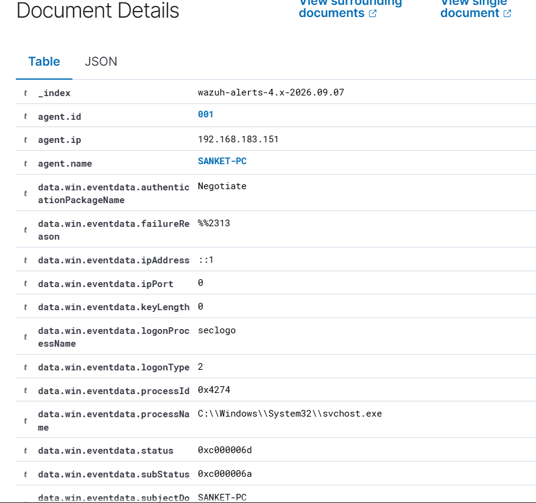

# Wazuh SIEM SOC Home Lab

A practical SOC analyst home-lab project demonstrating endpoint telemetry collection, Windows authentication monitoring, custom detection engineering, controlled attack simulation, MITRE ATT&CK mapping, and alert investigation using Wazuh.

## Project Outcome

This lab successfully detected repeated Windows authentication failures against the same account and generated a **custom Level 12 Wazuh alert**.

- **Custom rule:** `100101`
- **Parent rule:** `60122`
- **Windows Event ID:** `4625`
- **Detection threshold:** 5 failed logons for the same account within 60 seconds
- **MITRE ATT&CK:** `T1110 - Brute Force`
- **Endpoint:** `SANKET-PC`
- **Target test account:** `wazuhlab`
- **Disposition:** Authorized lab simulation / True positive detection

## Architecture

```text
Windows Endpoint (SANKET-PC)
        |
        | Wazuh Agent / TCP 1514
        v
Wazuh Manager
        |
        v
Filebeat
        |
        v
Wazuh Indexer
        |
        v
Wazuh Dashboard / Threat Hunting
```

## Detection Flow

```text
Failed Windows authentication
        ↓
Windows Security Event ID 4625
        ↓
Wazuh built-in rule 60122
        ↓
5 failures for the same username within 60 seconds
        ↓
Custom rule 100101
        ↓
Level 12 alert
        ↓
MITRE ATT&CK T1110 - Brute Force
```

## Custom Detection Rule

See [`rules/local_rules.xml`](rules/local_rules.xml).

```xml
<group name="windows,windows_security,authentication_failed,">
  <rule id="100101" level="12" frequency="5" timeframe="60">
    <if_matched_sid>60122</if_matched_sid>
    <same_field>win.eventdata.targetUserName</same_field>

    <description>Custom Detection: Multiple failed Windows logons for the same account within 60 seconds</description>

    <mitre>
      <id>T1110</id>
    </mitre>

    <group>authentication_failed,brute_force,custom_detection,</group>
  </rule>
</group>
```

## Controlled Simulation

A temporary Windows account named `wazuhlab` was used as the target. Repeated authentication attempts were generated with an intentionally incorrect password in the controlled lab.

See [`simulation/failed-login-test.ps1`](simulation/failed-login-test.ps1).

> Use the simulation only on systems you own or are explicitly authorized to test.

## Evidence

### Threat Hunting timeline



The timeline shows repeated built-in rule `60122` authentication-failure alerts, an account lockout alert (`60115`), and the custom Level 12 rule `100101`.

### Custom alert details



Important fields investigated include endpoint/agent name, source address, logon type, authentication package, process name, Windows status/substatus, target account, timestamp, rule ID, and severity.

## SOC Investigation Summary

The custom alert represented a true-positive detection caused by an authorized lab simulation. In a production SOC, the analyst would correlate the source, target user, host, timeline, failed-login volume, and any successful logon occurring after the failures.

Full report: [`docs/incident-report.md`](docs/incident-report.md)

## Troubleshooting Experience

This lab also involved realistic SIEM troubleshooting, including:
- Ubuntu LVM disk allocation
- Wazuh staged/manual installation
- Dashboard certificate permissions
- DHCP/bridged adapter IP changes
- Wazuh Indexer bind failures
- Filebeat TLS/certificate mismatch
- Dashboard-to-Indexer endpoint changes
- `kibanaserver` credential synchronization

See [`docs/troubleshooting.md`](docs/troubleshooting.md).

## Skills Demonstrated

- Wazuh SIEM
- SOC Monitoring
- Windows Event Logs
- Detection Engineering
- Wazuh Custom Rules
- MITRE ATT&CK
- Incident Investigation
- Threat Hunting
- Linux Administration
- Filebeat
- OpenSearch / Wazuh Indexer
- TLS Troubleshooting
- Network Troubleshooting

## Safety

This repository documents a controlled defensive-security lab. Do not use the simulation against systems or accounts without authorization.
